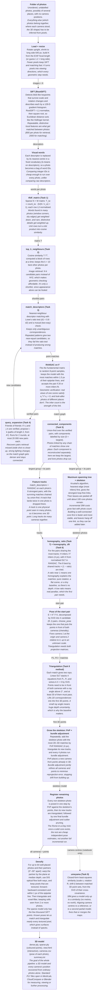

# Pipeline sheet: from a folder of photos to a 3D model

Roll number: ____________

```mermaid
flowchart TD
    A["<b>Folder of photos</b><br/>Unordered, unlabelled photos, possibly of several places, with no camera positions.<br/><i>Everything else (which photos belong together, where each camera stood, the 3D shape) has to be inferred from pixels.</i>"]
    B["<b>Load + resize</b><br/>Rotate upright, shrink to long side 640 px, build K from the EXIF focal length (or guess 1.2 × long side).<br/><i>Fewer pixels keep SIFT and matching fast. K turns pixels into viewing directions, which every geometric step needs.</i>"]
    C["<b>SIFT (RootSIFT)</b><br/>Detects blob-like keypoints that survive scale and rotation changes and describes each by a 128-D gradient histogram. RootSIFT = L1-normalise, then square root, so Euclidean distance acts like the Hellinger kernel.<br/><i>Repeatable, distinctive local features are what get matched between photos (800 per photo for retrieval, 2000 for matching).</i>"]
    D["<b>Visual words</b><br/>Each descriptor is replaced by its nearest centre in a fixed vocabulary (k-means on descriptors), so a photo becomes a bag of word IDs.<br/><i>Comparing integer IDs is cheap enough to run over every photo, unlike comparing raw descriptors.</i>"]
    E["<b>tfidf_matrix (Task 1)</b><br/>Sparse N × W matrix: T_iw ∝ count_iw · (ln(N / n_w) + 1), each row L2-normalised.<br/><i>Words found in many photos (window corners, sky edges) get weighted down, and rare, distinctive details get weighted up. Unit rows turn a dot product into cosine similarity.</i>"]
    F["<b>top_k_neighbours (Task 2)</b><br/>Cosine similarity T·Tᵀ, computed a block of rows at a time; keeps the k = 10 best other photos per photo.<br/><i>Image retrieval: N·k candidate pairs instead of N²/2, which makes geometric checking affordable. It's only a shortlist, since appearance alone can be fooled.</i>"]
    G["<b>match_descriptors (Task 3)</b><br/>Nearest-neighbour descriptor matching with Lowe's ratio test (d1 < 0.8 · d2) and a mutual (two-way) check.<br/><i>Keeps only unambiguous correspondences. Repeated patterns give two near-equal candidates, so they fail the ratio test instead of producing wrong matches.</i>"]
    H["<b>RANSAC on F</b><br/>Fits the fundamental matrix to random 8-point samples, keeps the model with the most matches within 1.5 px of their epipolar lines, and accepts the pair if 20 or more inliers fit.<br/><i>Geometric verification: real views of one scene satisfy x₂ᵀ F x₁ = 0, and look-alike photos of different places don't. The inlier count is the strength of the link.</i>"]
    I["<b>query_expansion (Task 4)</b><br/>Friends of friends: if i–j and j–k are verified, propose i–k (paths of length 2, from A²). Runs for 2 rounds, at most 20 000 new pairs each.<br/><i>Recovers pairs retrieval missed (wide shot vs close-up, strong lighting change), so the match graph gets denser and stays connected.</i>"]
    J["<b>connected_components (Task 5)</b><br/>Union-find over the verified pairs, with components labelled by size (0 = largest).<br/><i>Photos linked by any chain of matches show one place. Each component is reconstructed separately; here we keep the largest, and lone photos drop out.</i>"]
    K["<b>Maximum spanning tree + skeleton</b><br/>Kruskal's algorithm, heaviest edge (most inliers) first, gives the strongest loop-free links. Then leaves are peeled off until about 100 core photos remain.<br/><i>Incremental SfM costs grow fast with photo count. Building a well-connected core first is faster and more stable, and leaves hang off one link, so they can be added later.</i>"]
    L["<b>Feature tracks</b><br/>match_descriptors + RANSAC on each photo's 8 strongest pairs, with the surviving matches chained by union-find. A track that lands twice in one photo is dropped there.<br/><i>A track is one physical point seen in many photos, so it becomes one 3D point. Long tracks tie many cameras together.</i>"]
    M["<b>homography_ratio (Task 7) + homography_dlt (Task 6)</b><br/>For the pairs sharing the most tracks: H inliers / F inliers (4 px), with H from normalised DLT in RANSAC. The 8 best by shared tracks × (1 − ratio) are tried.<br/><i>A ratio near 1 means one homography explains the matches: pure rotation, a flat scene, or a tiny baseline, so there's no depth. A low ratio means real parallax, which the first pair needs.</i>"]
    N["<b>Pose of the start pair</b><br/>E = Kᵀ F K, decomposed by SVD into 4 candidate (R, t) pairs. choose_pose keeps the one that puts the points in front of both cameras (cheirality).<br/><i>Fixes camera 1 at the origin and camera 2 relative to it, up to an unknown scale. Triangulation needs both projection matrices.</i>"]
    O["<b>Triangulation (Task 8 method)</b><br/>Each match gives two rays. Linear DLT stacks 4 equations from P₁, P₂ and solves A X = 0 by SVD. Points need to be in front of both cameras with a ray angle above 2°, and at least 30 of them must pass.<br/><i>Lifts 2D correspondences into the first 3D points. A small ray angle means huge depth uncertainty, which is why the baseline matters.</i>"]
    P["<b>Grow the skeleton: PnP + bundle adjustment</b><br/>Repeatedly: add the skeleton photo with the most 2D–3D matches by PnP-RANSAC (4 px), triangulate its new tracks, and every 4 photos run bundle adjustment.<br/><i>PnP places a new camera from points already in 3D. Bundle adjustment jointly refines all cameras and points to minimise reprojection error, stopping drift from building up.</i>"]
    Q["<b>Register remaining photos</b><br/>Every non-skeleton photo is posed in one step by PnP against the skeleton's points, then its new tracks are triangulated, followed by one final bundle adjustment and outlier pruning.<br/><i>The Rome-in-a-Day trick: once a solid core exists, the rest are cheap independent pose estimates, not another full incremental run.</i>"]
    R["<b>Densify</b><br/>For up to 64 well-placed photos and their partners (3°–30° apart): warp the partner by the plane at median depth, use DIS optical flow both ways, and keep pixels that are textured, forward–backward consistent and within 1 px of the epipolar line. Then triangulate and voxel-filter, keeping cells seen from 2 or more photos.<br/><i>The sparse model only has the few thousand SIFT points. Known poses let us match and triangulate nearly every textured pixel, which gives surfaces instead of specks.</i>"]
    S["<b>3D model</b><br/>dense.ply, sparse.ply (coloured points), view.html (interactive), cameras.csv (pose of each photo), summary.txt<br/><i>The goal of the whole pipeline: a 3D model and every camera's position recovered from ordinary photos alone. Standard PLY files open in MeshLab, CloudCompare or Blender for measuring, viewing or further processing.</i>"]
    T["<b>umeyama (Task 9)</b><br/>Closed-form least-squares similarity (scale s, rotation R, shift t) between matched 3D point sets, from the SVD of their cross-covariance.<br/><i>SfM gives a model only up to a similarity (no metres, no north). Aligning camera centres to a reference, or to a second partial model, fixes that or merges the maps.</i>"]

    A --> B
    B -->|"images + K"| C
    C -->|"descriptors"| D
    D -->|"words per photo"| E
    E -->|"matrix T"| F
    F -->|"shortlist pairs"| G
    G -->|"point matches"| H
    H -->|"verified pairs"| I
    I -->|"new candidates"| G
    H -->|"match graph"| J
    J -->|"largest group + its pairs"| K
    J -->|"largest group + its pairs"| L
    K -->|"skeleton photos"| M
    L -->|"tracks"| M
    M -->|"start pair"| N
    N -->|"P1, P2 + matches"| O
    O -->|"first 3D points"| P
    P -->|"skeleton model"| Q
    Q -->|"all cameras + points"| R
    R --> S
    Q -.->|"camera centres (notebook only)"| T
```
